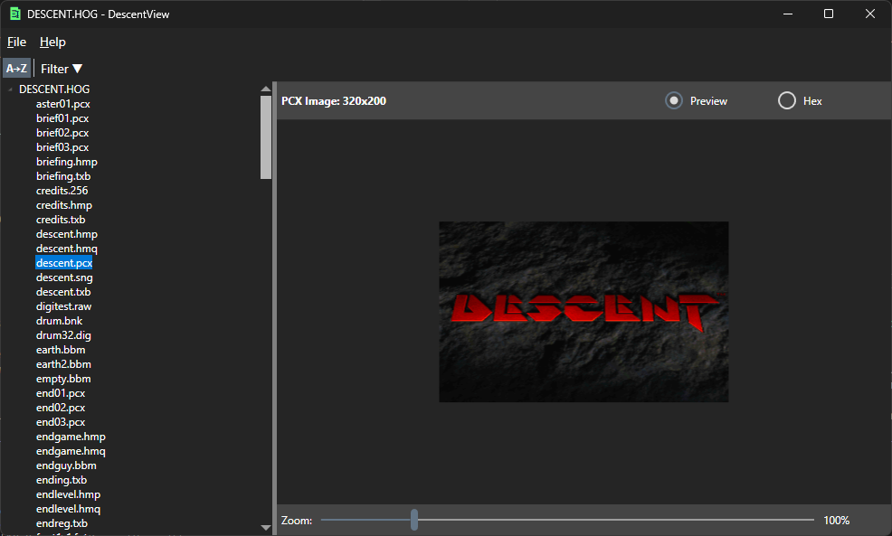

# DescentView

DescentView is an application for viewing archive files from the six-degrees-of-freedom games Descent (1995) and Descent 2 (1996), developed by Parallax Software.



## Usage

1. Click **File → Open** to select a HOG or PIG file (or pass a supported file as a command-line argument)
2. Browse the archive contents in the left-hand treeview
3. Click on a file to view its contents in the right-hand panel
4. Right-click a file in the left-hand treeview to extract the file

## Requirements

- .NET 10.0
- Windows OS

## Compiling

To clone and run this application, you'll need [Git](https://git-scm.com) and [.NET](https://dotnet.microsoft.com/) installed on your computer. From your command line:

```
# Clone this repository
$ git clone https://github.com/btigi/DescentView

# Go into the repository
$ cd src

# Build  the app
$ dotnet build
```

## Licencing

DescentView is licensed under the MIT license. Full licence details are available in license.md